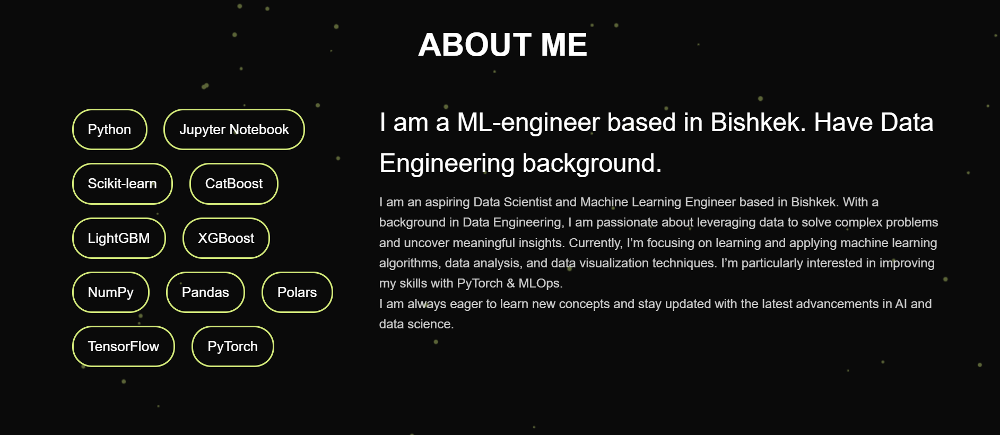

# Portfolio Website

**Автор:** Омуркулов Амир  
**Курс:** Web Development Class  

---

## Краткое описание
Это красивое и простое портфолио, созданное для демонстрации моих навыков веб-разработчика.  
Сайт включает следующие секции:  

- Главная 
- Проекты  
- Обо мне  
- Контакты  

---

## Особенности
- Плавный скролл по секциям
- Переключение светлой/тёмной темы
- Анимации кнопок и заголовков
- Частички на фоне
- Валидация формы контактов

---

## Структура проекта
- assets/     - изображения, иконки, шрифты
- index.html  - главная страница
- styles.css  - стили сайта
- script.js   - JS для интерактивности 

---

## Технологии
- HTML5
- CSS3
- JavaScript 

---

## Как запустить
1. Клонируйте репозиторий:
git clone https://github.com/JGRex-Joy/web-portfolio.git
2. Откройте `index.html` в любом браузере.

---

## Скриншоты

---

## Автор
- Имя: Омуркулов Амир  
- Email: omurkulovamir2008@email.com  
- GitHub: https://github.com/JGRex-Joy

